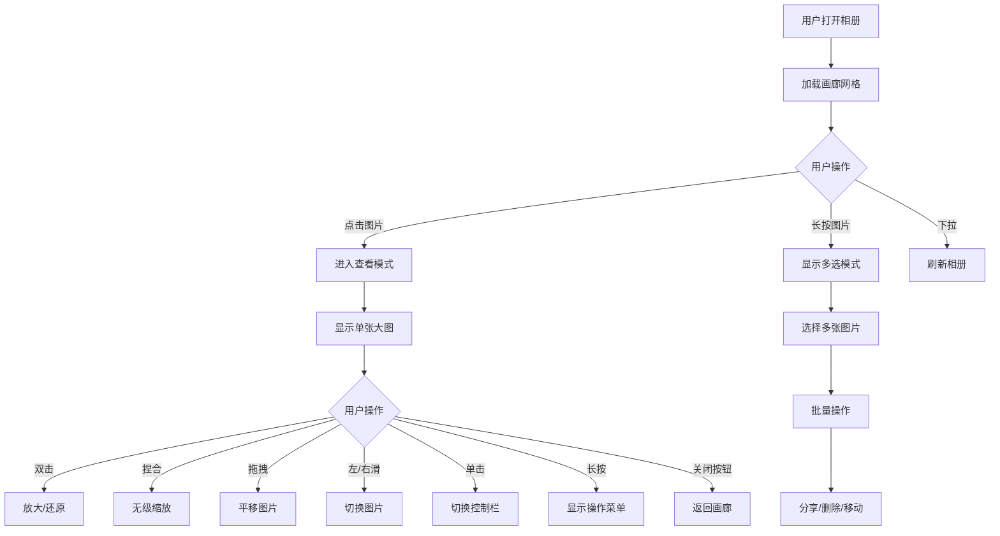
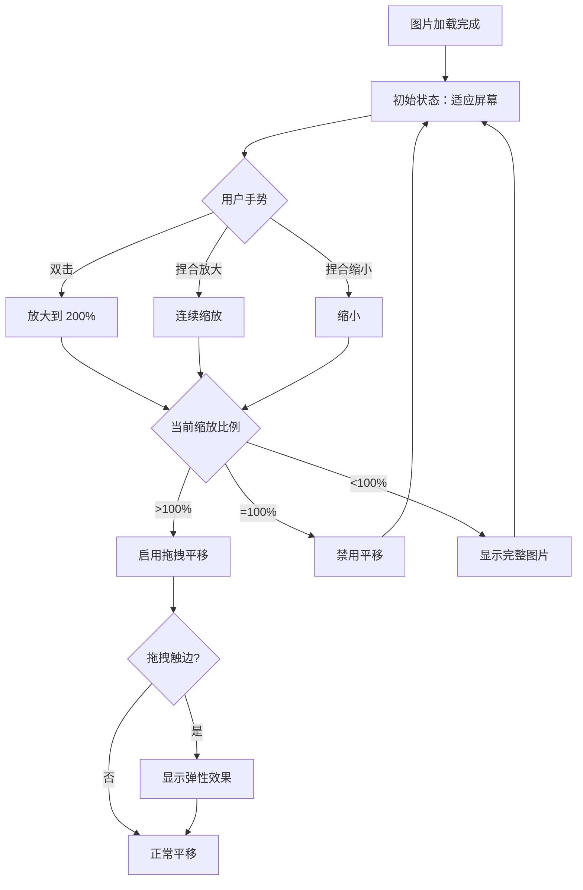
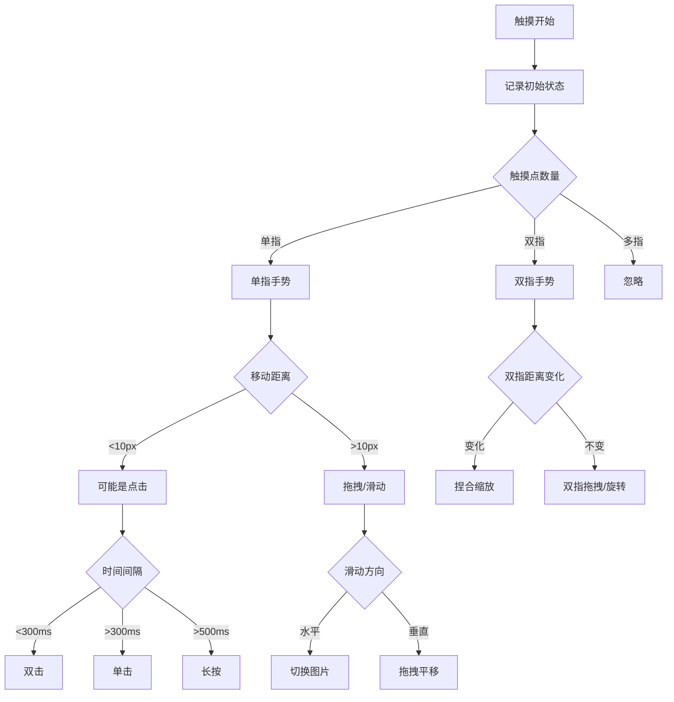
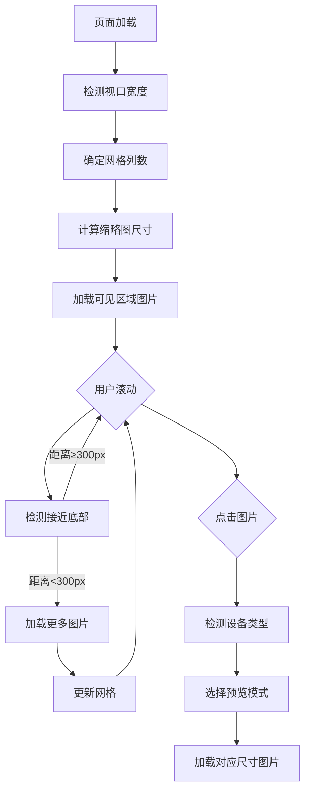

# 图片查看器 UI 交互设计方案

## 📋 文档概览

本文档详细描述了图片查看功能的 UI 交互设计方案，包括画廊模式布局、缩放交互动画、手势操作设计和响应式适配方案。

---

## 1️⃣ 画廊模式布局设计

### 1.1 布局结构

```
┌─────────────────────────────────────────────┐
│  Header (可选)                               │
│  [← 返回]  相册名称  [⋮ 更多]                 │
├─────────────────────────────────────────────┤
│                                             │
│  ┌───────┐  ┌───────┐  ┌───────┐           │
│  │       │  │       │  │       │           │
│  │  img1 │  │  img2 │  │  img3 │           │
│  │       │  │       │  │       │           │
│  └───────┘  └───────┘  └───────┘           │
│                                             │
│  ┌───────┐  ┌───────┐  ┌───────┐           │
│  │       │  │       │  │       │           │
│  │  img4 │  │  img5 │  │  img6 │           │
│  │       │  │       │  │       │           │
│  └───────┘  └───────┘  └───────┘           │
│                                             │
│  ┌───────┐  ┌───────┐  ┌───────┐           │
│  │       │  │       │  │       │           │
│  │  img7 │  │  img8 │  │  img9 │           │
│  │       │  │       │  │       │           │
│  └───────┘  └───────┘  └───────┘           │
│                                             │
├─────────────────────────────────────────────┤
│  Footer (可选)                               │
│  [◀ 1/50 ▶]  [♡ 收藏]  [↪ 分享]  [🗑 删除]   │
└─────────────────────────────────────────────┘
```

### 1.2 网格配置

| 设备类型 | 列数 | 间距 | 边距 | 图片比例 |
|---------|------|------|------|---------|
| 手机 (竖屏) | 3 列 | 4px | 8px | 1:1 (正方形) |
| 手机 (横屏) | 5 列 | 6px | 12px | 1:1 |
| 平板 | 4-6 列 | 8px | 16px | 4:3 |
| 桌面 | 6-8 列 | 12px | 24px | 16:9 |

### 1.3 交互状态

```css
/* 默认状态 */
.thumbnail {
  opacity: 1;
  transform: scale(1);
  transition: transform 0.2s ease;
}

/* 悬停状态 (桌面端) */
.thumbnail:hover {
  transform: scale(1.05);
  box-shadow: 0 4px 12px rgba(0,0,0,0.3);
}

/* 选中状态 */
.thumbnail.selected {
  border: 3px solid #0066FF;
  opacity: 0.9;
}

/* 加载状态 */
.thumbnail.loading {
  background: linear-gradient(90deg, #f0f0f0 25%, #e0e0e0 50%, #f0f0f0 75%);
  background-size: 200% 100%;
  animation: shimmer 1.5s infinite;
}
```

### 1.4 无限滚动加载

```
┌─────────────────┐
│   已加载图片     │
│   已加载图片     │
│   已加载图片     │
├─────────────────┤ ← 触发加载阈值 (距底部 300px)
│   加载中...     │ ← 显示加载指示器
│   占位符         │
│   占位符         │
└─────────────────┘
```

---

## 2️⃣ 缩放交互动画设计

### 2.1 缩放层级

```
缩放级别：
├── 100% (原始尺寸)
├── 150% (轻度放大)
├── 200% (中度放大)
├── 300% (深度放大)
└── 400% (最大放大)

支持范围：50% - 400%
```

### 2.2 动画曲线

```javascript
// 缩放动画配置
const zoomAnimation = {
  duration: 300,           // 毫秒
  easing: 'cubic-bezier(0.34, 1.56, 0.64, 1)', // 弹性效果
  spring: {
    tension: 300,
    friction: 20
  }
};

// 双击缩放动画
const doubleTapZoom = {
  from: 1.0,
  to: 2.0,
  duration: 250,
  easing: 'cubic-bezier(0.25, 0.46, 0.45, 0.94)'
};
```

### 2.3 缩放中心点

```
用户双击位置 = 缩放中心点

┌─────────────────────────┐
│                         │
│         ✦ 双击点         │
│           ↓             │
│      ┌───────┐          │
│      │ 放大  │          │
│      │ 区域  │          │
│      └───────┘          │
│                         │
└─────────────────────────┘

缩放时保持双击点位于视口中心
```

### 2.4 缩放状态转换图

```
┌──────────────┐
│   适应屏幕    │
│   (Fit)      │
└──────┬───────┘
       │ 双击/捏合放大
       ↓
┌──────────────┐
│   自由缩放    │
│   (Free)     │◄──────┐
└──────┬───────┘       │
       │ 双击/捏合缩小   │ 拖拽平移
       ↓               │
┌──────────────┐       │
│   适应屏幕    │───────┘
│   (Fit)      │
└──────────────┘
```

### 2.5 边界反弹效果

```javascript
// 超出边界时的弹性效果
const boundaryBounce = {
  overshoot: 0.15,         // 最大超出 15%
  bounceDuration: 400,     // 反弹动画时长
  easing: 'cubic-bezier(0.175, 0.885, 0.32, 1.275)'
};

// 视觉反馈
当图片触边时:
- 显示半透明阴影
- 轻微透明度变化 (0.95)
- 弹性回弹动画
```

---

## 3️⃣ 手势操作设计

### 3.1 手势映射表

| 手势 | 操作 | 适用场景 |
|------|------|---------|
| 单击 | 切换控制栏显示/隐藏 | 所有模式 |
| 双击 | 放大/还原 (200%) | 查看模式 |
| 双指捏合 | 无级缩放 | 查看模式 |
| 单指拖拽 | 平移图片 | 放大状态 |
| 双指拖拽 | 旋转图片 (可选) | 查看模式 |
| 左/右滑动 | 切换上一张/下一张 | 查看模式 |
| 长按 | 弹出操作菜单 | 所有模式 |
| 双指双击 | 还原到 100% | 查看模式 |

### 3.2 手势优先级

```
手势冲突解决优先级 (从高到低):

1. 双指捏合 (缩放)
   ↓
2. 双指拖拽 (旋转)
   ↓
3. 单指拖拽 (平移)
   ↓
4. 水平滑动 (切换图片)
   ↓
5. 双击 (快速缩放)
   ↓
6. 单击 (控制栏)
```

### 3.3 手势检测参数

```javascript
const gestureConfig = {
  // 双击检测
  doubleTap: {
    maxInterval: 300,      // 两次点击最大间隔 (ms)
    maxDistance: 20        // 两次点击最大距离 (px)
  },
  
  // 滑动检测
  swipe: {
    minDistance: 50,       // 最小滑动距离 (px)
    maxAngle: 30,          // 最大角度偏差 (度)
    minVelocity: 0.3       // 最小速度 (px/ms)
  },
  
  // 捏合检测
  pinch: {
    minScale: 0.5,         // 最小缩放比例
    maxScale: 4.0,         // 最大缩放比例
    sensitivity: 1.0       // 灵敏度
  },
  
  // 长按检测
  longPress: {
    duration: 500,         // 长按时长 (ms)
    maxMove: 10            // 最大移动距离 (px)
  }
};
```

### 3.4 手势反馈

```
触觉反馈 (Haptic Feedback):

├── 轻触 (Click)
│   └── 强度: 10%
│   └── 场景: 切换控制栏
│
├── 中触 (Medium)
│   └── 强度: 30%
│   └── 场景: 切换图片
│
├── 重触 (Heavy)
│   └── 强度: 50%
│   └── 场景: 双击缩放
│
└── 连续震动
    └── 强度: 20%
    └── 场景: 拖拽触边
```

### 3.5 手势状态机

```
                    ┌─────────────┐
                    │   空闲态     │
                    │   (Idle)    │
                    └──────┬──────┘
                           │
        ┌──────────────────┼──────────────────┐
        │                  │                  │
        ↓                  ↓                  ↓
   ┌─────────┐       ┌─────────┐       ┌─────────┐
   │ 单击态   │       │ 双击态   │       │ 长按态   │
   │ (Tap)   │       │(Double) │       │(Long)   │
   └────┬────┘       └────┬────┘       └────┬────┘
        │                  │                  │
        │ 超时             │ 完成             │ 完成
        ↓                  ↓                  ↓
   ┌─────────┐       ┌─────────┐       ┌─────────┐
   │ 切换 UI  │       │ 缩放    │       │ 菜单    │
   └─────────┘       └─────────┘       └─────────┘

        ┌──────────────────────────────────┐
        │                                  │
        ↓                                  ↓
   ┌─────────┐                       ┌─────────┐
   │ 拖拽态   │                       │ 捏合态   │
   │ (Pan)   │                       │ (Pinch) │
   └────┬────┘                       └────┬────┘
        │                                  │
        │ 移动                            │ 缩放
        ↓                                  ↓
   ┌─────────┐                       ┌─────────┐
   │ 平移图片 │                       │ 缩放图片 │
   └─────────┘                       └─────────┘
```

---

## 4️⃣ 响应式适配方案

### 4.1 断点设计

```css
/* 移动设备优先 */
:root {
  --breakpoint-sm: 576px;    /* 小手机 */
  --breakpoint-md: 768px;    /* 大手机/小平板 */
  --breakpoint-lg: 992px;    /* 平板 */
  --breakpoint-xl: 1200px;   /* 小桌面 */
  --breakpoint-xxl: 1600px;  /* 大桌面 */
}
```

### 4.2 布局适配

```
┌─────────────────────────────────────────────────────┐
│                    响应式布局                        │
├──────────┬──────────┬──────────┬──────────┬─────────┤
│   <576px │  576px   │  768px   │  992px   │ >1200px │
│   手机   │  大手机   │  平板    │  小桌面   │ 大桌面   │
├──────────┼──────────┼──────────┼──────────┼─────────┤
│  3 列网格  │  3-4 列   │  4-5 列   │  5-6 列   │ 6-8 列   │
│  全屏预览  │  全屏预览  │  弹窗预览  │  弹窗预览  │ 侧边栏   │
│  底部工具  │  底部工具  │  悬浮工具  │  顶部工具  │ 侧边工具  │
│  简化手势  │  完整手势  │  完整手势  │  完整手势  │ 键鼠支持  │
└──────────┴──────────┴──────────┴──────────┴─────────┘
```

### 4.3 组件适配策略

#### 4.3.1 画廊网格

```css
.gallery-grid {
  display: grid;
  gap: 4px;
  padding: 8px;
  
  /* 手机竖屏 */
  grid-template-columns: repeat(3, 1fr);
  
  /* 大手机/小平板 */
  @media (min-width: 576px) {
    gap: 6px;
    padding: 12px;
    grid-template-columns: repeat(4, 1fr);
  }
  
  /* 平板 */
  @media (min-width: 768px) {
    gap: 8px;
    padding: 16px;
    grid-template-columns: repeat(5, 1fr);
  }
  
  /* 桌面 */
  @media (min-width: 992px) {
    gap: 12px;
    padding: 24px;
    grid-template-columns: repeat(6, 1fr);
  }
  
  /* 大桌面 */
  @media (min-width: 1200px) {
    grid-template-columns: repeat(8, 1fr);
    max-width: 1400px;
    margin: 0 auto;
  }
}
```

#### 4.3.2 图片预览模式

```
手机 (<768px):
┌─────────────────┐
│                 │
│                 │
│     [图片]       │
│                 │
│                 │
├─────────────────┤
│ [←]  1/50  [→]  │  ← 底部工具栏
│ [♡] [↪] [🗑]   │
└─────────────────┘

平板/桌面 (≥768px):
┌─────────────────────────────────┐
│ [←]              1/50           │  ← 顶部工具栏
├─────────────────────────────────┤
│                                 │
│                                 │
│           [图片]                 │
│                                 │
│                                 │
├─────────────────────────────────┤
│ [♡ 收藏]  [↪ 分享]  [🗑 删除]     │  ← 底部操作区
└─────────────────────────────────┘
```

### 4.4 横竖屏适配

```css
/* 竖屏模式 */
@media (orientation: portrait) {
  .gallery-grid {
    grid-template-columns: repeat(3, 1fr);
  }
  
  .image-viewer {
    height: 70vh;  /* 留出工具栏空间 */
  }
}

/* 横屏模式 */
@media (orientation: landscape) {
  .gallery-grid {
    grid-template-columns: repeat(5, 1fr);
  }
  
  .image-viewer {
    height: 85vh;  /* 更多空间给图片 */
  }
}
```

### 4.5 安全区域适配 (iOS)

```css
/* 适配 iPhone 刘海和底部 Home Indicator */
.safe-container {
  padding-top: env(safe-area-inset-top);
  padding-bottom: env(safe-area-inset-bottom);
  padding-left: env(safe-area-inset-left);
  padding-right: env(safe-area-inset-right);
}

/* 工具栏适配 */
.toolbar {
  padding-bottom: calc(16px + env(safe-area-inset-bottom));
}
```

### 4.6 性能优化策略

```javascript
const responsiveOptimization = {
  // 图片加载策略
  imageLoading: {
    mobile: {
      thumbnail: '300x300',    // 缩略图尺寸
      preview: '800x800',      // 预览图尺寸
      full: 'original'         // 全图 (按需)
    },
    desktop: {
      thumbnail: '400x400',
      preview: '1200x1200',
      full: 'original'
    }
  },
  
  // 懒加载配置
  lazyLoad: {
    threshold: 300,            // 预加载距离 (px)
    maxConcurrent: 3,          // 最大并发加载数
    placeholder: 'blur'        // 占位符类型
  },
  
  // 内存管理
  memory: {
    maxCachedImages: 10,       // 最大缓存图片数
    unloadDistance: 5          // 卸载距离 (张)
  }
};
```

---

## 5️⃣ 交互流程图

### 5.1 整体交互流程



### 5.2 缩放交互流程



### 5.3 手势识别流程



### 5.4 响应式加载流程



---

## 6️⃣ 技术实现建议

### 6.1 推荐技术栈

```
前端框架:
├── React / Vue 3 / Svelte
├── 状态管理：Zustand / Pinia
└── 动画库：Framer Motion / GSAP

手势处理:
├── @use-gesture/react (React)
├── @vueuse/gesture (Vue)
└── 或原生 Touch Events

图片处理:
├── react-image-gallery / vue-gallery
├── photo-viewer
└── 自定义 Canvas 实现

性能优化:
├── Intersection Observer (懒加载)
├── Web Workers (图片处理)
└── Service Worker (缓存)
```

### 6.2 关键代码示例

```javascript
// 手势处理示例 (React + @use-gesture)
import { useGesture } from '@use-gesture/react'
import { animated, useSpring } from '@react-spring/web'

function ImageViewer({ images }) {
  const [{ scale, x, y }, api] = useSpring(() => ({
    scale: 1,
    x: 0,
    y: 0,
    config: { tension: 300, friction: 20 }
  }))

  const bind = useGesture({
    onPinch: ({ origin: [ox, oy], da: [d] }) => {
      api.start({ 
        scale: Math.min(Math.max(0.5 + d, 0.5), 4),
        origin: [ox, oy]
      })
    },
    onDrag: ({ movement: [mx, my] }) => {
      if (scale.get() > 1) {
        api.start({ x: mx, y: my })
      }
    },
    onDoubleClick: ({ event: { clientX, clientY } }) => {
      const newScale = scale.get() === 1 ? 2 : 1
      api.start({ scale: newScale, x: 0, y: 0 })
    }
  })

  return (
    <animated.div
      {...bind()}
      style={{ 
        transform: useSpring({
          transform: `translate(${x}px, ${y}px) scale(${scale})`
        })
      }}
    >
      
    </animated.div>
  )
}
```

### 6.3 无障碍访问 (A11y)

```html
<!-- 键盘导航支持 -->
<div 
  role="region" 
  aria-label="图片画廊"
  tabindex="0"
>
  <div 
    role="list" 
    aria-label="图片列表"
  >
    <div 
      role="listitem"
      tabindex="0"
      aria-label="图片 1 of 50"
      onkeydown="handleKeyNavigation(event)"
    >
      
    </div>
  </div>
</div>

<!-- 键盘快捷键 -->
快捷键映射:
├── Arrow Left/Right: 切换图片
├── Escape: 关闭预览
├── + / -: 缩放
├── 0: 重置缩放
└── Space: 暂停/播放 (幻灯片)
```

---

## 7️⃣ 测试清单

### 7.1 功能测试

- [ ] 画廊网格正确显示
- [ ] 图片点击进入预览
- [ ] 双击放大/还原
- [ ] 捏合缩放流畅
- [ ] 拖拽平移正常
- [ ] 滑动切换图片
- [ ] 长按显示菜单
- [ ] 边界反弹效果

### 7.2 响应式测试

- [ ] 手机竖屏 (320px)
- [ ] 手机横屏 (568px)
- [ ] 平板竖屏 (768px)
- [ ] 平板横屏 (1024px)
- [ ] 桌面 (1440px+)
- [ ] 超大屏幕 (1920px+)
- [ ] iOS 安全区域
- [ ] 横竖屏切换

### 7.3 性能测试

- [ ] 首屏加载时间 < 2s
- [ ] 滚动帧率 > 60fps
- [ ] 图片懒加载正常
- [ ] 内存占用合理
- [ ] 大量图片 (1000+) 不卡顿

### 7.4 兼容性测试

- [ ] iOS Safari
- [ ] Android Chrome
- [ ] Desktop Chrome
- [ ] Desktop Firefox
- [ ] Desktop Safari
- [ ] Edge

---

## 8️⃣ 版本规划

### v1.0 (MVP)
- 基础画廊网格
- 图片预览
- 双击缩放
- 滑动切换
- 基础响应式

### v1.5
- 捏合缩放
- 拖拽平移
- 长按菜单
- 无限滚动

### v2.0
- 幻灯片播放
- 图片编辑 (裁剪/滤镜)
- 分享功能
- 收藏/专辑

### v2.5
- AI 智能分类
- 相似图片识别
- 高级搜索
- 云同步

---

## 📝 修订记录

| 版本 | 日期 | 作者 | 变更说明 |
|------|------|------|---------|
| 1.0 | 2026-03-20 | designer | 初始版本 |

---

**文档状态**: ✅ 完成  
**最后更新**: 2026-03-20 01:43 UTC
